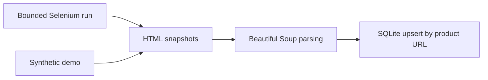

# Zer4U Product Scraper

A small Python scraping project for Zer4U flower-product listings. It combines bounded category pagination, optional product-detail extraction, image URL handling, and SQLite storage.

**Stack:** Python 3.12 · Selenium · Beautiful Soup · SQLite · unittest

**Status:** refactored learning project. The offline demo and tests use synthetic HTML. Current live-site compatibility has not been verified; this project does not claim complete catalog coverage or production reliability.

The Greek phonebook scraper belongs in the separate [11888-scrapper repository](https://github.com/NimLordia/11888-scrapper). See [project separation](docs/project-separation.md) for the recovered Zer4U history and file mapping.

## Try it without a browser

```sh
git clone https://github.com/NimLordia/zer4youscrap.git
cd zer4youscrap
python -m venv .venv
```

Activate the environment with `.venv\Scripts\Activate.ps1` in Windows PowerShell, or `source .venv/bin/activate` on macOS/Linux, then run:

```sh
python -m pip install -r requirements.txt
python -m zer4u --demo
python -m unittest discover -s tests -v
```

Expected demo output:

```text
Demo: synthetic sample records; no network or browser used.
Saved 2 unique product(s) to data/zer4u_demo.sqlite3. Existing URLs are updated.
```

The demo contains two invented Hebrew product names, prices, and image URLs under `example.invalid`. Running it again updates the same two rows. No live prices, downloaded images, or collected databases are included.

## Collect products

A live run uses headless Chrome. Selenium uses [Selenium Manager](https://www.selenium.dev/documentation/selenium_manager/) for driver management when a driver is not already available; initial setup may require network access.

```sh
python -m zer4u --max-pages 2 --max-products 40 --db data/products.sqlite3
python -m zer4u --mode details --max-pages 1 --max-products 10
python -m zer4u --help
```

| Option | Default | Meaning |
| --- | --- | --- |
| `--category-url` | Zer4U flower category | Category URL, including optional filters and starting `bscrp` |
| `--mode` | `cards` | Parse listing cards; `details` visits collected product links |
| `--max-pages` | `1` | Maximum category pages, incrementing `bscrp` |
| `--max-scrolls` | `3` | Maximum scroll-to-bottom attempts per category page |
| `--max-products` | `100` | Maximum saved products or visited detail pages |
| `--delay` | `2` | Seconds between page requests and scroll attempts |
| `--timeout` | `30` | Page-load and selector-wait timeout in seconds |
| `--db` | `data/zer4u_products.sqlite3` | Output database; demo has a separate default |

Pagination stops at the configured limit or when a page contains no new product URLs. An empty or unrecognized page is reported as a failure, because the scraper cannot reliably distinguish the end of a category from a loading problem or changed selectors. A successful run means its bounded extraction succeeded; it does not establish that every product was collected.

Only run live collection where permitted and respect the site's current access rules. Cookie/consent screens, anti-bot challenges, retry/backoff, and automatic resume are not implemented.

## Design and data



The parser keeps the original listing and detail selectors. It normalizes relative URLs, selects a usable image from `srcset`, and avoids saving known preload placeholders as product images. Names and prices are required; missing optional images are stored as empty strings. Price remains display text, preserving currency and formatting rather than assuming a numeric format.

| SQLite column | Meaning |
| --- | --- |
| `id` | Internal row ID |
| `product_url` | Unique source URL used to update repeat observations |
| `name` | Product name |
| `price` | Price as displayed |
| `img_url` | Resolved image URL, or empty if unavailable |

Products are written in one transaction after collection completes. If collection fails, that run does not save partial results. Browser and database handles are closed when their operations exit. Use a new database path: the earlier experimental schemas are not migrated automatically.

## Tests

Tests exercise parsing, Hebrew text, URL and image handling, database deduplication, and bounded browser orchestration using a fake driver. GitHub Actions runs the offline suite and demo on Python 3.12. Tests never contact Zer4U or launch Chrome; live selectors and browser rendering remain an integration check.

```text
zer4u/scraper.py            Parsing, pagination, browser lifecycle, SQLite storage
zer4u/__main__.py           Command-line entrypoint
zer4u/demo.py               Synthetic listing HTML
tests/                     Offline regression tests
docs/project-separation.md Original project ownership and migration notes
```
